# EdgeBinder Architecture Diagram

This document contains the class and interface diagram for the EdgeBinder library based on the proposal.

## Class Diagram

```mermaid
classDiagram
    %% Core Interfaces
    class EdgeBinderInterface {
        <<interface>>
        +bind(EntityInterface from, EntityInterface to, string type, array metadata) BindingInterface
        +unbind(string bindingId) void
        +query() QueryBuilderInterface
        +updateMetadata(string bindingId, array metadata) void
        +getMetadata(string bindingId) array
    }

    class PersistenceAdapterInterface {
        <<interface>>
        +store(BindingInterface binding) void
        +find(string bindingId) BindingInterface|null
        +findByEntity(string entityType, string entityId) array
        +delete(string bindingId) void
        +updateMetadata(string bindingId, array metadata) void
    }

    class BindingInterface {
        <<interface>>
        +getId() string
        +getFromEntity() EntityInterface
        +getToEntity() EntityInterface
        +getType() string
        +getMetadata() array
        +setMetadata(array metadata) void
    }

    class QueryBuilderInterface {
        <<interface>>
        +from(EntityInterface entity) QueryBuilderInterface
        +to(EntityInterface entity) QueryBuilderInterface
        +type(string type) QueryBuilderInterface
        +where(string key, mixed operator, mixed value) QueryBuilderInterface
        +orderBy(string key, string direction) QueryBuilderInterface
        +limit(int limit) QueryBuilderInterface
        +get() array
    }

    class MetadataInterface {
        <<interface>>
        +getVectorProperties() array
        +getGraphProperties() array
        +getBusinessProperties() array
        +getCustomProperties() array
    }

    class EntityInterface {
        <<interface>>
        +getId() string
        +getType() string
    }

    %% Core Implementation Classes
    class EdgeBinder {
        -PersistenceAdapterInterface adapter
        -EventDispatcherInterface eventDispatcher
        +__construct(PersistenceAdapterInterface adapter, EventDispatcherInterface eventDispatcher)
        +bind(EntityInterface from, EntityInterface to, string type, array metadata) BindingInterface
        +unbind(string bindingId) void
        +query() QueryBuilderInterface
        +updateMetadata(string bindingId, array metadata) void
        +getMetadata(string bindingId) array
    }

    class BindingQueryBuilder {
        -PersistenceAdapterInterface adapter
        -array criteria
        +__construct(PersistenceAdapterInterface adapter)
        +from(EntityInterface entity) QueryBuilderInterface
        +to(EntityInterface entity) QueryBuilderInterface
        +type(string type) QueryBuilderInterface
        +where(string key, mixed operator, mixed value) QueryBuilderInterface
        +orderBy(string key, string direction) QueryBuilderInterface
        +limit(int limit) QueryBuilderInterface
        +get() array
    }

    class RelationshipMetadata {
        -array vectorProperties
        -array graphProperties
        -array businessProperties
        -array customProperties
        +__construct(array vectorProps, array graphProps, array businessProps, array customProps)
        +getVectorProperties() array
        +getGraphProperties() array
        +getBusinessProperties() array
        +getCustomProperties() array
        +withVector(string key, mixed value) RelationshipMetadata
        +withGraph(string key, mixed value) RelationshipMetadata
        +withBusiness(string key, mixed value) RelationshipMetadata
        +withCustom(string key, mixed value) RelationshipMetadata
    }

    class Binding {
        -string id
        -EntityInterface fromEntity
        -EntityInterface toEntity
        -string type
        -array metadata
        +__construct(string id, EntityInterface from, EntityInterface to, string type, array metadata)
        +getId() string
        +getFromEntity() EntityInterface
        +getToEntity() EntityInterface
        +getType() string
        +getMetadata() array
        +setMetadata(array metadata) void
    }

    %% Persistence Adapters
    class InMemoryAdapter {
        -array bindings
        +store(BindingInterface binding) void
        +find(string bindingId) BindingInterface|null
        +findByEntity(string entityType, string entityId) array
        +delete(string bindingId) void
        +updateMetadata(string bindingId, array metadata) void
    }

    %% Event Classes
    class BindingCreated {
        -BindingInterface binding
        -DateTime createdAt
        +__construct(BindingInterface binding)
        +getBinding() BindingInterface
        +getCreatedAt() DateTime
    }

    class BindingDeleted {
        -string bindingId
        -DateTime deletedAt
        +__construct(string bindingId)
        +getBindingId() string
        +getDeletedAt() DateTime
    }

    class BindingUpdated {
        -BindingInterface binding
        -array oldMetadata
        -array newMetadata
        -DateTime updatedAt
        +__construct(BindingInterface binding, array oldMetadata, array newMetadata)
        +getBinding() BindingInterface
        +getOldMetadata() array
        +getNewMetadata() array
        +getUpdatedAt() DateTime
    }

    %% Relationships
    EdgeBinder ..|> EdgeBinderInterface : implements
    EdgeBinder --> PersistenceAdapterInterface : uses
    EdgeBinder --> QueryBuilderInterface : creates
    EdgeBinder --> BindingInterface : creates
    EdgeBinder --> BindingCreated : dispatches
    EdgeBinder --> BindingDeleted : dispatches
    EdgeBinder --> BindingUpdated : dispatches

    BindingQueryBuilder ..|> QueryBuilderInterface : implements
    BindingQueryBuilder --> PersistenceAdapterInterface : uses

    RelationshipMetadata ..|> MetadataInterface : implements
    
    Binding ..|> BindingInterface : implements
    Binding --> EntityInterface : references
    Binding --> MetadataInterface : contains

    InMemoryAdapter ..|> PersistenceAdapterInterface : implements

    %% Styling
    classDef interface fill:#e1f5fe,stroke:#01579b,stroke-width:2px
    classDef concrete fill:#f3e5f5,stroke:#4a148c,stroke-width:2px
    classDef adapter fill:#e8f5e8,stroke:#1b5e20,stroke-width:2px
    classDef event fill:#fff3e0,stroke:#e65100,stroke-width:2px


```

## Architecture Overview

The EdgeBinder library follows a clean architecture pattern with clear separation of concerns:

### Core Interfaces
- **EdgeBinderInterface**: Main facade for all binding operations
- **PersistenceAdapterInterface**: Abstraction for different persistence backends
- **BindingInterface**: Represents a relationship between two entities
- **QueryBuilderInterface**: Fluent interface for querying bindings
- **MetadataInterface**: Structured approach to relationship metadata
- **EntityInterface**: Basic contract for entities that can be bound

### Core Implementation
- **EdgeBinder**: Main implementation that orchestrates all operations
- **BindingQueryBuilder**: Provides fluent query building capabilities
- **RelationshipMetadata**: Rich metadata support for graph/vector databases
- **Binding**: Concrete implementation of a relationship

### Persistence Adapters
The library supports multiple persistence backends through adapters:
- **InMemoryAdapter**: Built-in adapter for testing and development
- **Other adapters**: Various persistence implementations can be created by implementing PersistenceAdapterInterface

### Event System
Events are dispatched for important operations:
- **BindingCreated**: When a new binding is established
- **BindingDeleted**: When a binding is removed
- **BindingUpdated**: When binding metadata is modified

### Key Design Principles

1. **Persistence Agnostic**: Switch between different persistence backends without code changes
2. **Metadata First**: Rich metadata support for graph and vector database scenarios
3. **Clean Architecture**: No pollution of domain entities with relationship concerns
4. **Framework Agnostic**: Works with any PHP project
5. **Event Driven**: Optional event system for relationship change notifications
6. **Type Safe**: Strong typing throughout the library
7. **Extensible**: Easy to add new persistence adapters and functionality
